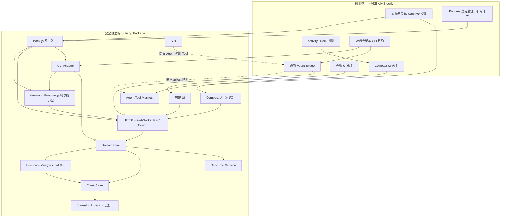

# Aily 通用 Subapp 架构与开发执行指南

> 文档版本：1.0
> 基线日期：2026-07-24
> 参考实现：`serial-debugger`
> 适用仓库：`aily-subapp`、`aily-blockly`，以及通过 Aily 通用协议接入的其他宿主

## 1. 文档定位

本文不是 Serial Debugger 的功能说明，也不以当前尚未完成的 MQTT Debugger 为架构基线。本文从已经完成多轮真实硬件、Agent、CLI、UI 和大日志验证的 `serial-debugger` 出发，提炼一套可复用的 Subapp 架构规范。

后续开发新的 Subapp 时，应把本文作为：

- 架构设计基线；
- 目录和协议模板；
- Agent Tool、Skill、CLI、UI 的职责边界；
- Runtime、daemon、资源会话和宿主会话的生命周期规范；
- 大数据、日志、artifact 和结果预算规范；
- 开发、link、构建、测试、发布和验收清单；
- 代码评审和重构现有 Subapp 的判断依据。

本文使用以下规范词：

- **必须（MUST）**：不满足会破坏通用宿主兼容性、生命周期正确性或安全边界。
- **应该（SHOULD）**：默认应实现，只有明确、记录过的理由才能省略。
- **可以（MAY）**：按 Subapp 能力等级选择。

## 2. 总体结论

一个成熟的 Subapp 不应被理解为“一个 iframe 页面”“一个 CLI”或“一个 Skill”。它应被理解为：

> 一个完全独立的领域 Runtime，通过稳定协议向 CLI、完整 UI、Compact UI、Agent Tool 和不同宿主暴露同一份能力与状态。

通用架构的核心决策如下：

1. **领域 Core 是唯一业务实现。** UI、CLI、WebSocket、HTTP 和宿主都只是适配器。
2. **Runtime 是运行期唯一状态源。** 设备连接、网络连接、订阅、事务、日志游标、场景和分析状态不能分别保存在 CLI 与 UI 中。
3. **Subapp 与 Blockly 完全解耦。** Subapp 不导入 Blockly/Lex 代码，不探测 `child/tools`，不依赖 AppData 安装位置，也不要求 Electron API。
4. **宿主只实现通用机制。** Blockly 不应包含 `serial.*`、`mqtt.*` 等领域特判。
5. **Agent 同时使用 Tool 与 Skill。** Tool 承载可验证的领域操作；Skill 负责策略、顺序、安全提示和结果解释。
6. **CLI 是独立自动化入口和兼容降级，不是另一套业务实现。**
7. **daemon 是长会话能力，不是所有 Subapp 的强制要求。**
8. **完整数据留在 Runtime 的 Journal/artifact 中，Agent 只接收有界摘要、游标和证据引用。**
9. **Runtime 进程、领域资源会话、WebSocket 客户端、Agent 会话租约和 UI 展示状态是五种不同对象，不能混为一谈。**
10. **资源清理由生命周期和租约保证，不能依赖 Agent “记得执行 stop”。**
11. **UI 是 Runtime 的观察者和操作者，不是硬件或网络资源的所有者。**
12. **发生连接恢复时，不得自动重放可能已有副作用的领域请求。**

## 3. 能力分级：不要让所有 Subapp 都照搬 Serial Debugger

Subapp 应先确定自己的能力等级，再决定是否需要 CLI、daemon、Journal、artifact、场景执行器和 Compact UI。

| 等级 | 特征 | 示例 | 必需能力 |
| --- | --- | --- | --- |
| L0 展示型 | 主要处理本地输入并展示结果，无长时间后台状态 | 字体生成、格式转换预览 | Core、serve、UI、Manifest |
| L1 请求型 | 每次请求相对独立，可短进程完成 | 文件转换、一次性扫描 | Core、CLI、serve、RPC、结果预算 |
| L2 会话型 | 需要跨多次调用保留连接或上下文 | BLE、网络诊断、简单 MQTT | 共享 Runtime、资源会话、事件流、取消、生命周期清理 |
| L3 长会话/高吞吐型 | 持续连接、持续数据、日志可能达到 MiB/GiB | Serial、完整 MQTT、总线抓包 | L2 全部能力，加 daemon、租约、Journal、artifact、保留策略、分析和压力测试 |

选择规则：

- 操作能在一次请求内安全完成时，不要为了“统一”引入 daemon。
- 需要“连接一次、连续发送/订阅/分析”时，至少采用 L2。
- 数据可能超过 Agent 或宿主返回限制时，必须采用 Journal/artifact，而不是提高无限制返回上限。
- Agent 运行过程需要让用户持续观察时，应提供 Compact UI。
- 需要用户完成复杂配置、协议编辑或历史检索时，应同时提供完整 UI。

`serial-debugger` 是 L3 参考实现。完整 MQTT Debugger 也应按 L3 设计，因为 MQTT 连接、订阅、QoS、持续消息和大日志天然是长会话状态。

## 4. 统一术语

后续设计和代码评审必须明确区分下列对象：

| 对象 | 含义 | 典型生命周期 |
| --- | --- | --- |
| Subapp Package | 可安装、可独立启动的源码或发布包 | 安装到卸载 |
| Runtime Process | 承载 Core、Server、事件和持久化的 OS 进程 | 启动到退出 |
| Resource Session | 串口连接、MQTT 连接、BLE 连接等领域资源 | open/connect 到 close/disconnect |
| RPC Client | 一个 UI、Agent 或 CLI 到 Runtime 的连接 | WebSocket 建立到关闭 |
| Host Process Reference | 宿主对某 Runtime 的进程引用计数 | acquire 到 release |
| Agent Session Lease | 某个对话会话对 Runtime/资源的所有权声明 | 对话会话创建到 dispose |
| Scenario Run | 一组可取消、可观察、可暂停的自动化步骤 | started 到 terminal |
| Activity Projection | 宿主 UI 中对运行状态的有界投影 | 调用开始到会话释放 |
| Journal | Runtime 的顺序化、分段持久事件记录 | Runtime session 到保留期结束 |
| Artifact | 可分页读取或搜索的受控文件证据 | 创建到保留期结束 |

最常见的错误是把“WebSocket 断开”理解为“应关闭设备”，或把“某一轮 Agent 结束”理解为“对话会话结束”。这两种行为都会破坏多客户端和多轮调试。

## 5. 总体架构



这张图最重要的含义是：

- 宿主永远不直接调用 `SerialPort`、MQTT Client 或其他领域 SDK。
- UI 不直接拥有设备或网络连接。
- Agent Bridge 不理解领域方法的语义，只按 Manifest 映射和校验。
- CLI、Server、UI 和 Agent 最终进入同一个 Core。
- Activity 只是一份状态投影，不是日志存储，也不拥有 Runtime。

## 6. 从内到外逐层剖析

### 6.1 第 0 层：领域模型与错误模型

这一层定义领域对象、状态机、输入规范、错误码和不变量，不依赖进程、网络、UI 或宿主。

以 Serial Debugger 为例：

- 领域对象：串口端口、串口选项、连接状态、控制信号、RX/TX。
- 状态：disconnected、connecting、connected、closing、error。
- 不变量：未连接不可发送；同一资源不能无策略地重复占用；主动关闭与意外断开必须区分。
- 错误：`PORT_DISCONNECTED`、`DEVICE_DISCONNECTED`、`EXPECT_TIMEOUT` 等结构化错误。

以 MQTT Debugger 为例，应定义：

- Broker endpoint、TLS、认证、Client ID、Clean Start、Keep Alive；
- connecting、connected、reconnecting、offline、disconnecting；
- subscription、QoS、retained、will、message correlation；
- `BROKER_UNREACHABLE`、`AUTH_FAILED`、`SUBSCRIBE_REJECTED`、`PUBLISH_TIMEOUT` 等错误码。

要求：

- 错误必须包含稳定 `code`、可读 `message` 和有界 `details`。
- 错误码必须表达领域原因，不能只返回原始库异常文本。
- 敏感信息不得进入错误详情、事件或日志。

### 6.2 第 1 层：Resource Session

Resource Session 是唯一直接调用硬件、网络或原生 SDK 的组件。

它负责：

- open/connect、status、close/disconnect；
- read/write、publish/subscribe 等底层操作；
- 将第三方库事件转换为内部领域事件；
- 幂等关闭和异常断开；
- 恢复控制信号、取消监听器、释放句柄；
- 对资源操作进行串行化或互斥控制。

它不负责：

- CLI 参数解析；
- HTTP、WebSocket；
- Angular/React/Vue；
- Agent Tool 名称；
- Blockly 对话会话；
- 大模型分析。

Resource Session 应支持依赖注入。例如 Serial Debugger 可注入 `SerialPortClass`，MQTT 可注入 Client Factory，从而让单元测试不依赖真实硬件或 Broker。

### 6.3 第 2 层：Domain Core

Core 是 Subapp 的稳定领域 API 和唯一业务编排入口。

职责包括：

- 组合 Resource Session、Event Store、Journal、Scenario 和 Analyzer；
- 暴露领域方法和统一 `executeAction` 路由；
- 在操作前后发出规范事件；
- 将取消信号向下传递；
- 返回有界、结构化结果；
- 统一快照；
- 幂等 `cleanup`。

Core 必须满足：

- 不导入 UI 框架、Electron、Blockly 或 Lex；
- 不读取宿主安装路径；
- 不在多个适配器中复制领域逻辑；
- 可在纯 Node 测试中直接实例化；
- 所有状态变更都能通过事件和快照观察。

`serial-debugger` 的关键正确性模式值得复用：

- `transact` 在发送前先注册响应等待器，避免设备极速回显导致丢失；
- 每个长操作使用独立 `AbortController`；
- started/completed/failed 使用同一事件链；
- 结果只返回预览、字节数、时间和证据游标；
- `cleanup` 先取消场景，再关闭设备，最后关闭 Journal。

### 6.4 第 3 层：Runtime 数据层

Runtime 数据层通常分三层：

1. **Event Store：** 内存热数据；
2. **Journal：** 磁盘权威历史；
3. **Artifact Store：** Agent/UI 可控读取的文件证据。

不是所有 Subapp 都必须持久化，但所有持续流式数据的 Subapp 必须至少有有界内存层。

Serial Debugger 当前参考值：

- Event Store：最多 50,000 条或 10 MiB；
- tail：默认 200 条，最大 500 条；
- Journal segment：默认 32 MiB；
- 单 Runtime session Journal：默认最大 512 MiB；
- 默认保留 7 天；
- 全局默认最大 2 GiB；
- 低磁盘和临界磁盘阈值会改变健康状态并阻止继续写入；
- artifact 单次读取和搜索均有硬上限。

这些数值是参考值，不是所有 Subapp 的固定规范。必须遵守的规则是：

- 内存、单页、单会话和全局磁盘均有上限；
- Journal 分段、追加写入；
- 超限时可丢弃数据，但必须记录 dropped 计数和健康事件；
- artifact 只能访问已注册且位于受管根目录内的文件；
- 读取采用 cursor/offset 分页；
- 搜索有扫描字节数、匹配数和预览长度上限。

### 6.5 第 4 层：自动化与分析

复杂 Subapp 可以增加两个可选组件：

- **Scenario Runner：** 执行有界、多步骤、可取消的自动化测试；
- **Analyzer：** 对事件或 Journal 进行规则分析，返回带证据的发现。

Scenario 必须具备：

- 最大步骤数；
- 总超时和单步超时；
- `stopOnFailure`；
- 每步 started/completed/failed 事件；
- 取消；
- 结果预算；
- 证据游标；
- 明确的操作者身份。

当允许人工接管时，还必须具备：

- pause 只在安全边界生效；
- takeover 只能授予一个操作者；
- release 后保持暂停，直到显式 resume；
- cancel 终止场景，不应默认关闭整个领域连接；
- 客户端意外断开时释放其接管权。

Analyzer 必须把结果表达为“基于规则和证据的发现”，不能把启发式结论伪装成确定事实。每条 finding 至少应包含：

- `code`；
- `severity`；
- `title/message`；
- `recommendation`；
- `firstSeq/lastSeq` 或 artifact 引用。

### 6.6 第 5 层：Transport Server

Server 负责把 Core 暴露为本地 HTTP + WebSocket Runtime。

基线要求：

- 默认只监听 `127.0.0.1`；
- 默认使用 `port=0` 让系统分配端口；
- 每次启动生成高熵随机 token；
- WebSocket 和敏感 HTTP API 校验 token；
- 提供 `/health`；
- 提供受 token 保护的 `/api/shutdown`；
- 安全地提供静态 UI、i18n、assets 和 vendor 文件；
- 静态路径解析后必须仍在受管目录内；
- WebSocket 请求有最大 payload；
- 每个请求有独立取消控制器；
- 连接关闭时取消该连接尚未完成的请求；
- Server stop 时依次清理 Core、客户端和监听器。

Server 不应知道 Agent Tool 的用户可见名称；它只理解稳定 RPC method。

### 6.7 第 6 层：进程与入口适配

`index.js` 是统一进程入口。它只选择运行模式，不实现领域功能。

推荐命令：

```text
node index.js rpc
node index.js serve --host 127.0.0.1 --port 0
node index.js <domain-cli-command>
node index.js daemon start
node index.js daemon status
node index.js daemon stop
node index.js daemon-run        # 内部命令，不面向普通用户
```

默认命令可以兼容旧宿主使用 `rpc`，但必须在 README 中明确。

### 6.8 第 7 层：体验适配

同一 Runtime 可以同时被以下客户端使用：

- 完整 UI；
- Compact UI；
- Agent Tool；
- CLI；
- 自动化脚本；
- 其他兼容宿主。

这些客户端不得各自创建一套领域状态。它们只通过 Core/RPC 观察和操作共享 Runtime。

## 7. 完全独立解耦规范

### 7.1 Subapp 必须独立拥有的内容

Subapp Package 必须自己包含：

- `package.json` 和 `ailySubapp` Manifest；
- Node 入口；
- Core 和领域依赖；
- Server；
- UI 静态产物；
- i18n 和 assets；
- Agent Tool Manifest（若支持 Agent）；
- Skill（若支持 Agent 工作流）；
- 运行时依赖及必要原生 prebuild；
- 自己的测试。

### 7.2 Subapp 禁止依赖的内容

Subapp 禁止：

- 导入 `aily-blockly`、Aily Chat 或 Lex 源码；
- 调用 Blockly 的 Angular Service；
- 硬编码 `D:\codes`、`child/tools` 或 AppData 安装目录；
- 从宿主目录反向读取配置或源码；
- 假设自己一定运行在 Electron iframe；
- 把宿主窗口是否打开作为领域操作成功的依据；
- 直接写入宿主对话状态、Todo 或 Activity 数据结构。

### 7.3 宿主禁止依赖的内容

通用宿主禁止：

- 按 `serial-debugger`、`mqtt-debugger` 名称写专用分支；
- 直接调用领域 SDK；
- 解析领域日志正文以推导连接状态；
- 猜测 RPC method；
- 从历史 `child/tools` 扫描新 Subapp；
- 把 iframe 生命周期等同于 Runtime 生命周期。

宿主只通过以下通用契约工作：

- npm 安装目录；
- catalog/index；
- `package.json#ailySubapp`；
- `agent/tools.json`；
- `ready/fatal` stdout；
- HTTP/WebSocket RPC；
- Penpal Host Context；
- Activity summary；
- session lease。

### 7.4 安装位置不是协议

Windows 当前默认安装根目录为：

```text
%LOCALAPPDATA%\aily-project\npm-global\app
```

包位于该目录的 `node_modules/<package-name>` 下。macOS/Linux 使用各自的平台路径，也可以被环境变量覆盖。

这一位置只是宿主的包管理实现，不是 Subapp 业务协议。Subapp 必须通过 `__dirname`、包内相对路径和显式 Runtime 根目录解析自己的资源，不能感知自己是：

- 源码目录；
- npm link/junction；
- 正式安装包；
- `dist/<tool-id>` 构建产物；
- 其他宿主中的安装包。

## 8. 运行模式与选择

| 模式 | 启动者 | 状态是否跨调用 | 典型用途 | 退出责任 |
| --- | --- | --- | --- | --- |
| direct CLI | 用户/脚本 | 否 | L1 一次性任务 | 命令 finally 清理 |
| stdio RPC | 旧宿主/脚本 | 由进程决定 | 兼容已有进程协议 | 启动者 |
| serve | 宿主或开发脚本 | 是 | UI、Agent、共享 Runtime | 宿主引用归零后停止 |
| persistent daemon | 用户显式启动 | 是 | 独立长期监控 | 用户显式 stop |
| session-leased daemon | Agent CLI 降级启动 | 是 | 多次 CLI 调用共享状态 | 会话租约失效后自动退出 |
| serve-attached | 宿主发现已有 daemon | 是 | UI/宿主加入已有 Runtime | 不得关闭非自己拥有的 daemon |

### 8.1 Direct CLI

仅适用于无跨命令状态，或一个命令内部完成 open→operate→close 的场景。

错误做法：

```text
cli open
cli send
cli read
```

如果每条命令都创建新进程和新 Core，那么 `open` 进程退出后连接已经不存在，后续 `send` 不可能使用同一会话。

正确选择：

- 将完整事务做成一个 direct 命令；或
- CLI 自动连接共享 Runtime/daemon。

### 8.2 Serve

这是宿主标准模式：

```text
node index.js serve --host 127.0.0.1 --port 0
```

进程必须在 stdout 输出一行可机器解析的 ready JSON。日志写 stderr，不得污染 stdout 协议。

参考：

```json
{
  "event": "ready",
  "data": {
    "mode": "serve",
    "url": "http://127.0.0.1:54321/?token=...",
    "origin": "http://127.0.0.1:54321",
    "wsUrl": "ws://127.0.0.1:54321/ws?token=...",
    "shutdownUrl": "http://127.0.0.1:54321/api/shutdown?token=...",
    "port": 54321,
    "pid": 1234
  }
}
```

启动失败时应输出结构化 `fatal`，随后以非零状态退出。

### 8.3 Persistent daemon

只有用户显式请求长期后台运行时才使用。它的关键语义是：

- `daemon start --persist` 表示用户拥有；
- 宿主和 Agent 可以附着；
- 宿主会话结束不能停止它；
- `daemon stop` 才结束；
- status 不泄露 token。

### 8.4 Session-leased daemon

Agent 在只能执行 CLI 的环境中，需要跨多次命令保持连接，但不能遗留永久后台进程。解决方案是会话租约：

1. 宿主为对话会话创建 lease 文件；
2. CLI 进程收到：
   - `AILY_AGENT_SESSION_ID`
   - `AILY_AGENT_SESSION_LEASE_FILE`
   - `AILY_AGENT_SESSION_OWNER_PID`
3. CLI 启动或附着 daemon，并注册 lease；
4. daemon 周期检查 lease 文件和 owner PID；
5. 对话会话 dispose 或宿主退出时删除 lease；
6. 最后一个 lease 失效并经过 grace period 后，daemon 自动清理资源并退出。

因此：

- 不需要 Agent 手工执行 `daemon stop`；
- 每一轮 turn 结束不删除 lease；
- 整个 chat/session 结束才删除；
- 用户显式 persistent daemon 不受 Agent lease 影响。

### 8.5 Serve attach

当宿主启动 `serve` 时发现已有健康 Runtime，应该附着并返回已有 endpoint，而不是再创建第二个领域 Runtime。

要求：

- 使用排他锁防止并发双启动；
- descriptor 原子写入；
- 读取 descriptor 后同时验证 PID 和 `/health`；
- stale descriptor/lock 只能在确认 owner 不存在后清理；
- attach 进程不得停止它不拥有的 daemon；
- 不向客户端暴露 Runtime token 之外的敏感内部信息。

## 9. 所有权与生命周期

### 9.1 所有权不是“谁最后调用了方法”

至少要区分：

- Runtime 进程所有者；
- Resource Session 所有者；
- Agent 对话会话；
- UI 客户端；
- 自动化场景操作者；
- 显式 persistent 用户。

共享 Runtime 不等于所有客户端都能无冲突地修改资源。每个 Subapp 必须选择并记录资源所有权模型：

| 模型 | 适用场景 | 要求 |
| --- | --- | --- |
| 单共享资源 | Serial 当前基线、单 MQTT Client | 同一时刻一个连接配置，变更需显式 close/reconnect |
| 多命名资源 | 多 Broker、多设备 | 每个资源有 `resourceId`，所有 RPC 明确目标 |
| 只读多观察者 + 单写所有者 | 抓包、自动场景 | 写操作鉴权，观察者不影响资源 |

如果允许用户 UI 与 Agent 同时持有资源，生命周期清理必须 owner-aware，不能因为最后一个 Agent session 结束就关闭仍被用户显式保留的资源。

### 9.2 宿主引用计数

宿主应按 `toolId` 共享一个 Runtime session：

- 完整 UI acquire 一次；
- Agent Bridge acquire 一次；
- 其他真正拥有 Runtime 的客户端各 acquire 一次；
- Compact UI 默认只 observe，不额外 acquire；
- release 后引用数减一；
- 引用归零后等待短 grace period；
- grace 内重新 acquire 则取消停止；
- grace 后才停止宿主拥有的 serve 进程。

当前 Blockly 参考 grace period 为 15 秒，用于避免 UI 切换或短暂重连造成频繁重启。

### 9.3 Agent Bridge 的会话集合

通用 Bridge 应按 Subapp 维护一个 WebSocket channel，并记录：

- `sessionIds: Set<string>`；
- 是否存在 unscoped owner；
- 是否已经 acquire Runtime；
- 未完成请求；
- 预期关闭和意外关闭。

一个对话会话释放时：

1. 从 channel 的 `sessionIds` 删除；
2. 如果仍有其他 session 或 unscoped owner，保留 Runtime；
3. 如果是最后一个 owner，调用 Manifest 的 `lifecycle.sessionRelease`；
4. 关闭 channel；
5. release 宿主 Runtime 引用；
6. 更新 Activity 为 stopped/cancelled；
7. 删除外部 CLI lease 文件。

### 9.4 标准清理时机

| 事件 | 是否关闭 RPC 请求 | 是否关闭领域资源 | 是否停止 Runtime |
| --- | --- | --- | --- |
| 一次 Tool 调用完成 | 完成当前请求 | 否 | 否 |
| 一轮 Agent turn 完成 | 取消未完成请求 | 通常否 | 否 |
| Compact UI 折叠/销毁 | 关闭该 UI WebSocket | 否 | 否 |
| 完整 UI 关闭 | 关闭该 UI 客户端并 release 引用 | 按产品策略，不应隐式破坏共享 Agent 资源 | 仅引用归零后 |
| Chat session dispose | 释放该 session 的请求和资源 lease | 最后 owner 时按 Manifest 清理 | 引用归零后 |
| 宿主应用退出 | 取消所有请求、释放所有宿主 session | 是 | 停止宿主拥有进程 |
| persistent daemon 的客户端退出 | 仅关闭客户端 | 否 | 否 |
| daemon 最后 session lease 失效 | 取消所有请求 | 是 | 是 |

### 9.5 清理必须幂等

以下操作必须可以重复调用而不会产生二次错误：

- `session.close` / `disconnect`；
- `cleanup`；
- Server `stop`；
- channel `release`；
- lease 文件删除；
- stale descriptor 清理。

## 10. RPC 与事件协议

### 10.1 协议版本

所有协议必须显式带 `protocolVersion`。当前基线为 `1`。

版本规则：

- 同一 major 内只能增加可选字段或新 method；
- 不得改变既有字段语义；
- 客户端忽略未知字段；
- Runtime 提供 `runtime.capabilities`；
- 不支持的 method 返回稳定错误码；
- 破坏性变更必须提升协议版本并提供迁移期。

### 10.2 RPC 请求

```json
{
  "id": "agent-1720000000000-1",
  "method": "device.transaction.run",
  "params": {
    "send": { "mode": "text", "data": "hello" }
  },
  "context": {
    "actor": "agent",
    "actorId": "subapp-agent-host",
    "runId": "optional-run-id",
    "stepId": "optional-step-id"
  }
}
```

要求：

- `id` 在连接内唯一；
- method 使用 `<domain>.<resource>.<verb>`；
- 参数必须是对象；
- `context` 是通用审计上下文，不能包含 Blockly 私有对象；
- Runtime 不信任客户端输入，必须二次验证。

### 10.3 RPC 响应

成功：

```json
{
  "id": "agent-1720000000000-1",
  "ok": true,
  "result": {
    "status": "completed",
    "evidence": {
      "startSeq": 120,
      "endSeq": 126
    }
  },
  "error": ""
}
```

失败：

```json
{
  "id": "agent-1720000000000-1",
  "ok": false,
  "result": {},
  "error": "Response did not match before timeout",
  "errorCode": "EXPECT_TIMEOUT",
  "details": {
    "timeoutMs": 3000,
    "evidence": {
      "startSeq": 120,
      "endSeq": 124
    }
  }
}
```

### 10.4 取消

通用取消 method：

```json
{
  "id": "cancel-agent-1720000000000-1",
  "method": "runtime.request.cancel",
  "params": {
    "requestId": "agent-1720000000000-1"
  }
}
```

规则：

- Tool Manifest 必须声明 `supportsCancellation`；
- timeout 和外部 AbortSignal 都应触发 Runtime cancel；
- cancel 是协作式的，Core 必须在安全点检查；
- cancel 终止当前操作，不默认关闭整个资源会话；
- Server 仍应返回取消请求是否命中 active request。

### 10.5 事件

统一事件 envelope：

```json
{
  "protocolVersion": 1,
  "event": "device.rx",
  "seq": 126,
  "timestamp": 1784860000000,
  "sessionId": "runtime-session-id",
  "actor": "runtime",
  "actorId": "optional",
  "runId": "optional",
  "stepId": "optional",
  "data": {
    "byteLength": 5,
    "text": "hello"
  }
}
```

事件规则：

- `seq` 在一个 Runtime session 内严格递增；
- 时间戳由 Runtime 生成或规范化；
- 同一份 canonical envelope 按顺序进入 Event Store、Journal 和广播；
- 不能为 UI、Agent、Journal 分别构造语义不同的事件；
- 大 payload 应只保留预览和 artifact 引用；
- started/completed/failed 应能通过 runId/stepId 关联。

## 11. 大日志和结果预算

### 11.1 完整保存不等于完整返回

大数据链路必须分层：

```text
设备/网络原始数据
  -> Runtime Event
  -> 有界内存 Event Store
  -> 分段 Journal / Artifact
  -> 有界 query/search/read
  -> Tool 结果摘要 + evidence
  -> Agent 上下文
```

Agent 不应直接接收几 MiB 日志。即使底层模型支持更大上下文，也会造成：

- 宿主 Tool 返回被截断或拒绝；
- JSON 序列化和 IPC 压力；
- Agent 关注点被原始数据淹没；
- 重试成本高；
- UI 与 Agent 同时卡顿。

### 11.2 多层预算

至少同时设置：

- WebSocket `maxPayload`；
- Tool `maxInputBytes`；
- Tool `maxOutputBytes`；
- 单页 `maxBytes`；
- 单事件 `previewBytes`；
- Event Store `maxEvents/maxBytes`；
- Journal segment 和 session 上限；
- artifact read/search 上限；
- CLI stdout 上限；
- 场景结果上限；
- Analyzer `maxEvents/maxFindings`。

推荐 Tool 默认返回预算为 48 KiB。具体值可以调整，但不得使用“无限制”。

### 11.3 证据模型

当结果被压缩或截断时，返回：

```json
{
  "summary": "2 transactions failed; 1 timeout",
  "returnedBytes": 8240,
  "truncated": true,
  "evidence": {
    "startSeq": 1020,
    "endSeq": 1188,
    "artifactId": "journal-000003",
    "offset": 131072
  },
  "nextAfterSeq": 1188,
  "hasMore": true
}
```

Agent 接着使用 logs/artifact search/read 定向取证，而不是要求 Runtime 重新返回全部历史。

## 12. Agent 形态：Skill 与 Tool 必须分工

### 12.1 最终选择

对于 Serial、MQTT、BLE 等有状态 Subapp，最佳形态不是 Skill 或 Tool 二选一，而是：

> **Tool 提供能力，Skill 提供方法。**

### 12.2 Tool 的职责

Tool 应负责：

- 列举资源；
- open/connect/status/close；
- send/transact/publish/subscribe；
- 有界读取日志；
- artifact 分页和搜索；
- 场景运行与控制；
- 分析；
- 结构化错误、取消和预算。

Tool 是 Agent 可可靠调用的领域 API。它不应要求 Agent 拼接 shell 命令或解析自然语言日志。

### 12.3 Skill 的职责

Skill 应负责：

- 推荐的调用顺序；
- 何时使用 transact，何时使用单向 send；
- 波特率、QoS、超时等领域策略；
- 上传/烧录前释放串口等安全提示；
- 如何根据错误码继续诊断；
- 如何使用 evidence、cursor 和 artifact；
- 何时打开完整 UI；
- 何时请求人工接管；
- 工作结束时的资源策略。

Skill 禁止：

- 把 CLI 当作唯一主路径；
- 声称 CLI 可以打开 embedded UI；
- 告诉 Agent 每个命令都启动新的一次性 Runtime；
- 要求 Agent 读取任意绝对路径；
- 把大日志直接打印到结果；
- 把“Tool 调用已成功”描述为“用户已经看到 UI”，除非有宿主 presentation 证据。

### 12.4 CLI 降级

仅在宿主没有加载 Agent Tool 或外部 Agent 不支持通用 Bridge 时降级到 CLI。

降级路径仍必须：

- 连接同一 Runtime；
- 使用会话租约；
- 输出有界 JSON；
- 使用相同错误码和证据模型；
- 不通过 shell 输出模拟 UI 已打开；
- 不要求 Agent 手工清理 session-leased daemon。

## 13. Agent Tool Manifest

`agent/tools.json` 是 Agent 领域能力的权威声明。`package.json` 只负责指向它。

通用示例：

```json
{
  "protocolVersion": 1,
  "transport": "aily-child-rpc",
  "lifecycle": {
    "sessionRelease": {
      "method": "device.session.close",
      "params": {},
      "timeoutMs": 5000
    }
  },
  "tools": [
    {
      "name": "device_session_manage",
      "description": "Open, inspect, or close the shared device session.",
      "rpc": {
        "actionParam": "action",
        "methods": {
          "open": "device.session.open",
          "status": "device.session.status",
          "close": "device.session.close"
        }
      },
      "presentation": {
        "mode": "dock",
        "surface": "compact",
        "autoOpen": "first-active",
        "when": {
          "param": "action",
          "values": ["open"]
        }
      },
      "permission": "change",
      "requiresSession": false,
      "supportsCancellation": true,
      "timeoutMs": 30000,
      "maxTimeoutMs": 60000,
      "maxInputBytes": 1048576,
      "maxOutputBytes": 49152,
      "inputSchema": {
        "type": "object",
        "required": ["action"],
        "properties": {
          "action": {
            "type": "string",
            "enum": ["open", "status", "close"]
          }
        },
        "additionalProperties": false
      }
    }
  ]
}
```

每个 Tool 必须声明：

- 全局唯一、稳定的 `name`；
- 对 Agent 有实际决策帮助的 `description`；
- `rpc.method`，或 `actionParam + methods` 映射；
- `permission: read | change`；
- `requiresSession`；
- `supportsCancellation`；
- 默认和最大超时；
- 输入和输出预算；
- 严格 JSON Schema。

命名建议：

```text
<domain>_<resource>_<verb>
serial_session_manage
mqtt_subscription_manage
mqtt_message_publish
mqtt_logs_read
```

不要把一个无边界的 `execute_anything` 暴露给 Agent。

## 14. Package Manifest

通用 `package.json` 示例：

```json
{
  "name": "@aily-project/subapp-device-debugger",
  "version": "0.1.0",
  "private": true,
  "description": "Standalone device debugger Runtime for Aily-compatible hosts",
  "ailySubapp": {
    "app": {
      "icon": "fa-light fa-puzzle-piece",
      "enabled": true
    },
    "runtime": {
      "startupTimeoutMs": 20000
    },
    "ui": {
      "surfaces": {
        "compact": {
          "minWidth": 280,
          "minHeight": 180,
          "preferredHeight": 320,
          "interactive": true
        }
      }
    },
    "agent": {
      "protocolVersion": 1,
      "skills": [
        "skill/device-debugger/SKILL.md"
      ],
      "tools": {
        "transport": "aily-child-rpc",
        "manifest": "agent/tools.json"
      }
    }
  },
  "main": "index.js",
  "bin": {
    "aily-device-debugger": "index.js"
  }
}
```

注意：

- Manifest 中的文件路径必须是包内相对路径；
- 宿主会验证路径不能逃出 package root；
- UI surface 的 `entry` 可以显式填写；
- 如果源码 link 和发布包的 UI 路径不同，可以省略 compact `entry`，让宿主回退到已解析的 `uiIndex`；
- 当前通用回退候选包括 `ui/index.html` 和 `dist/<catalog-id>/ui/index.html`；
- 不得填绝对路径；
- protocol 当前只接受受支持的版本和 transport；
- Tool 重名、路径不存在、Schema 非法都应让安装配置明确报错。

Catalog/index 与 package Manifest 的职责不同：

- catalog/index：可发现、可安装的包名、版本、标题、namespace；
- package Manifest：已安装包自身的 Runtime、UI 和 Agent 能力。

## 15. 推荐目录

### 15.1 L0/L1 最小目录

```text
<tool-id>/
  package.json
  index.js
  core.js
  cli.js
  server.js
  readme.md
  i18n/
    en.json
    zh_cn.json
  assets/
  ui/
  test/
```

### 15.2 L2/L3 推荐目录

```text
<tool-id>/
  package.json
  package-lock.json
  index.js
  core.js
  cli.js
  server.js
  readme.md

  agent/
    tools.json

  runtime/
    event-store.js
    result-budget.js
    expectation-engine.js
    rpc-client.js
    runtime-paths.js
    daemon.js
    lease-monitor.js
    journal.js
    artifact-store.js
    retention.js
    scenario-controller.js
    scenario-runner.js
    analyzer.js

  skill/
    <skill-id>/
      SKILL.md
      skill_zh.md
      agents/
        openai.yaml

  i18n/
    en.json
    zh_cn.json
    ...

  assets/

  ui/
    package.json
    src/
      app/
        app.*
        compact-surface.*
        runtime-store.*

  scripts/
    build-ui.mjs
    stress-large-log.mjs

  test/
    manifest.test.js
    core.test.js
    cli.test.js
    server.test.js
    daemon.test.js
    runtime-shared.test.js
    event-store.test.js
    journal.test.js
    retention.test.js
    scenario.test.js
    decoupling.test.js
```

文件名可以变化，但职责边界不能消失。

### 15.3 模板策略

当前 `templates/subapp`、`subapp-angular`、`subapp-vue` 和 `subapp-react` 主要提供基础 Core/CLI/Server/UI 壳，适合 L0/L1 起步。它们目前没有完整包含 Serial Debugger 已具备的 Agent Manifest、共享 Runtime、daemon、lease、Journal、artifact 和 Compact UI 能力。

因此：

- 不能因为项目来自现有模板，就认为它自动符合 L2/L3；
- L0/L1 可以继续使用当前基础模板；
- L2 应在基础模板上增加 `agent/`、共享 Runtime、事件、取消和生命周期；
- L3 再增加 daemon、lease、Journal、artifact、retention、场景和压力测试；
- 不建议把整个 Serial Debugger 复制成一个巨型通用模板；
- 后续可以维护“基础模板 + 能力 overlay”，例如 `agent-tools`、`compact-ui`、`persistent-runtime`、`journal-artifact`，减少模板漂移。

## 16. CLI 规范

### 16.1 输出

除 `--help` 外，每次 CLI 调用 stdout 必须只有一个 JSON envelope：

```json
{
  "ok": true,
  "command": "transact",
  "data": {},
  "error": "",
  "errorCode": ""
}
```

规则：

- 调试日志写 stderr；
- stdout 不打印 banner、进度条或混合文本；
- 结果有硬预算；
- 超预算时返回摘要和 evidence，不直接截断成非法 JSON；
- exit code 与 `ok` 一致；
- token 不出现在 status 或普通结果；
- `--help` 可以输出人类可读文本。

### 16.2 命令语义

必须区分：

- `write/send/publish`：只确认写入 Runtime/底层客户端；
- `transact/request`：发送后等待特定响应；
- `logs read`：有界分页读取；
- `artifact read/search`：受管证据访问；
- `session status`：不改变状态；
- `session close`：幂等释放资源。

“发送成功”不能等同于“设备正确响应”。

### 16.3 CLI 与 UI

CLI 不应声称已经打开 embedded/window UI。只有宿主 presentation 层能完成并确认这一动作。

CLI 可以：

- 输出 Runtime URL，供用户自己打开；
- 启动 standalone serve/daemon；
- 连接共享 Runtime；
- 操作资源和读取证据。

## 17. UI 架构

### 17.1 一个 Runtime Store

目标架构中，完整 UI 与 Compact UI 应复用同一套前端 RPC Client/Runtime Store 实现。每个 iframe/UI 实例可以各自持有一条 WebSocket，但都连接同一个 Runtime endpoint；同一 UI 实例内不能由多个组件重复建连。

共享 Store 实现应统一管理：

- 该 UI 实例唯一的 WebSocket；
- Runtime connection state；
- snapshot；
- 资源列表；
- 领域连接状态；
- Agent/scenario/analysis 状态；
- 有界日志 tail；
- RPC pending map；
- 事件去重和游标。

组件只消费 Store，不各自解析 WebSocket。

当前 Serial Debugger 的 Compact UI 已使用 `SerialRuntimeStore`，完整 UI 仍保留自己的 WebSocket 客户端实现。两者已经连接同一个后端 Runtime，但前端客户端代码尚未完全合并。这是后续可继续消除的技术债，新的 Subapp 不应复制两套 RPC Client。

### 17.2 完整 UI

完整 UI 适合：

- 完整连接参数；
- 手工发送/发布；
- DTR/RTS 等低级控制；
- 场景编辑；
- 大日志查询；
- artifact 查看；
- 分析详情；
- 高级设置。

### 17.3 Compact UI

Compact UI 是 Agent 活动的同步可视化，不是完整页面缩小版。

Serial 参考信息：

- 串口；
- 波特率；
- 连接/断开；
- 当前记录状态；
- Agent/场景/分析状态；
- RX/TX/SYS 有界 tail。

应省略：

- 大文本输入；
- DTR/RTS/RST 等低频高级控制；
- 大型编辑器；
- 完整历史；
- 会遮挡对话的弹窗。

MQTT Compact UI 可显示：

- Broker；
- Client 连接状态；
- 订阅数量；
- 最近 topic；
- RX/TX 消息计数；
- 当前 Agent 操作；
- 最近有界消息预览。

### 17.4 UI 不是资源所有者

UI 销毁时：

- 关闭自己的 WebSocket；
- 取消自己的 pending 请求；
- 释放自己的人工接管权；
- 不默认关闭共享领域资源。

如果用户点击明确的“断开”，才调用领域 disconnect。

### 17.5 晚加入与恢复

UI 可能在 Agent 已运行后才打开。它必须：

1. 从 URL 立即读取 token、lang、theme、surface；
2. 连接 WebSocket；
3. 请求 `runtime.snapshot`；
4. 从快照恢复连接、场景和分析状态；
5. 从最近 cursor 拉有界 tail；
6. 此后只消费实时事件。

内存事件已丢弃时，从 Journal 做一次有界补读，而不是加载全部历史。

## 18. Host Context 与 Penpal 控制面

Host 与 iframe 之间的 Penpal 只用于低频控制面，例如：

- `childReady`；
- `childError`；
- `setHostContext`；
- `beforeClose`；
- `requestClose`；
- `requestRestart`；
- `openExternal`；
- `reportActivity`。

高频领域数据必须走 Subapp 自己的 WebSocket，不得经 Angular 父页面转发。

Compact UI 的 `reportActivity` 必须：

- 只提交通用字段；
- 总大小有上限，当前建议不超过 1 KiB；
- 只包含 `state/label/detail/badge` 等摘要；
- 不包含 HTML；
- 不包含原始日志；
- 不包含 token 或凭据。

宿主提供的 Host Context 应保持通用，例如：

```json
{
  "lang": "zh_cn",
  "theme": "dark",
  "surface": "compact",
  "toolId": "device-debugger",
  "instanceId": "..."
}
```

## 19. Activity 与 Dock

Activity 是宿主侧的可视化投影，按 `sessionId + toolId` 唯一标识。

它至少区分三类状态：

- invocation：idle/running/succeeded/failed/cancelled；
- runtime：unknown/starting/ready/stopped/error；
- surface：collapsed/expanded。

设计规则：

- Activity 不保存完整日志；
- Activity 不拥有 Runtime；
- Activity summary 不能替代 Runtime snapshot；
- 同一对话可以同时展示多个 Subapp；
- 多个 Compact UI 在对话左侧或 Dock 中纵向排列，不相互覆盖；
- `autoOpen=first-active` 只在首次活跃时展开；
- `on-error` 仅出错时展开；
- session release 后 Activity 进入停止态并拒绝旧事件覆盖新状态。

## 20. 宿主通用职责

### 20.1 Subapp Manager

负责：

- 从用户级 npm 项目发现已安装包；
- 读取 catalog 和 package Manifest；
- 解析 `main`、`uiIndex`、surface、Skill、Tool Manifest；
- 验证所有包内路径；
- 验证协议版本、transport、Tool 名称、预算和超时；
- 动态注入通用 Child Tool 配置。

不负责领域能力。

### 20.2 Child Runtime Process Service

负责：

- 每个 toolId 单例 Runtime session；
- single-flight acquire；
- 启动 `node <entry> serve --host 127.0.0.1 --port 0`；
- 解析 ready/fatal；
- 启动超时；
- 引用计数；
- grace period；
- expected/unexpected close；
- restart/stop/stopAll；
- 暴露只读 Runtime snapshot。

### 20.3 Subapp Agent Bridge

负责：

- 从 Manifest 解析 Tool；
- 参数到 RPC method 的映射；
- 输入/输出预算；
- timeout；
- AbortSignal 和 `runtime.request.cancel`；
- 每个 toolId 共享 WebSocket；
- 每个 chat session 的 lease；
- presentation 请求；
- Activity 更新；
- session release lifecycle。

Bridge 连接失败时可以在**发送领域请求前**重新 acquire 并重连一次。领域请求发送后连接中断时，不得自动重放。

### 20.4 UI Host Registry

负责：

- 按 `toolId + instanceId` 注册完整或 Compact host；
- status/restart/close/detach/embed；
- 区分 primary/full 与 compact surface；
- 避免不同 surface 控制错误实例。

### 20.5 Chat Runtime 资源操作

Agent 运行时通过通用资源操作 `kind: subapp-agent` 进入 renderer/host Bridge：

```json
{
  "sessionId": "...",
  "kind": "subapp-agent",
  "payload": {
    "adapter": "subappAgent",
    "action": "execute",
    "input": {
      "toolId": "serial-debugger",
      "tool": "serial_transact",
      "params": {}
    }
  }
}
```

session dispose 时发送 `action: releaseSession`。资源操作 kind 必须在 Host Contract、session store 和 handler 三处一致注册，避免出现 `Unsupported resource operation kind: subapp-agent`。

## 21. Runtime 发现、锁与 descriptor

L3 Subapp 应在平台状态目录维护：

```text
<runtime-root>/
  runtime.json
  runtime.lock
  <runtime-session-id>/
    metadata.json
    journal-000001.jsonl
    rx-text-000001.log
    ...
```

要求：

- Runtime root 可由显式参数或环境变量覆盖；
- 目录不位于源码和 npm 包中；
- lock 使用排他创建；
- descriptor 使用临时文件 + rename 原子替换；
- descriptor 至少包含 pid、startedAt、origin、endpoint、sessionId、mode；
- descriptor 中的 token 不通过普通 status 返回；
- stale 判断同时检查进程和健康端点；
- 清理前验证目标路径确实在 Runtime root 内；
- 只有 owner PID 可以清理自己的 lock/descriptor。

## 22. 安全边界

所有 Subapp 必须满足：

- 仅 loopback 监听；
- endpoint token；
- token 不进日志、Activity、分析结果和普通 status；
- 输入 Schema；
- WebSocket payload 上限；
- 请求 timeout；
- 结果预算；
- 静态路径 containment；
- artifact path containment；
- 文件权限尽可能使用 owner-only；
- 凭据不写 Journal；
- 敏感字段在错误、事件和 snapshot 中脱敏；
- 外部 URL 通过宿主安全能力打开；
- 任何 destructive action 明确标记 `permission: change`；
- 不执行 Agent 传入的任意 shell；
- regex 长度、扫描大小和运行时间有限制；
- 原生资源清理放在 finally/cleanup。

MQTT 特别注意：

- 用户名、密码、证书私钥不得出现在事件、artifact 或 Activity；
- Broker URL 中的凭据必须剥离；
- 发布 retained 消息和高 QoS 操作属于 change；
- 通配符订阅应有显式范围和速率保护；
- 自动重连不得无限制重放 publish。

## 23. 可靠性与故障边界

### 23.1 不自动重放副作用请求

以下操作可能已经成功但响应丢失：

- 串口发送；
- MQTT publish；
- 文件写入；
- 控制信号；
- 设备 reset；
- 场景步骤。

连接断开后，宿主只能：

- 报告结构化“不确定结果”；
- 给出 requestId 和 evidence cursor；
- 重新连接后读取状态或日志；
- 由 Agent/用户决定是否重试。

不得无条件自动再发一次。

### 23.2 错误分类

建议统一分类：

| 类别 | 示例 | retryable |
| --- | --- | --- |
| 输入错误 | Schema、非法参数 | false |
| 前置条件 | 未连接、资源被占用 | 视情况 |
| 领域超时 | expect timeout、publish ack timeout | true，但不得自动重放 |
| Runtime 通信 | endpoint missing、connect failed | 通常 true |
| Runtime 退出 | process closed | true，需恢复状态 |
| 权限/安全 | token、path、permission | false |
| 存储健康 | disk low、journal blocked | 视策略 |
| 取消 | user/host abort | false |

### 23.3 Journal 故障

磁盘不足时：

- 不得让日志写失败直接击穿领域连接；
- 必须发出 health warning/error；
- 进入 write-blocked；
- 统计 dropped bytes；
- Tool 和 UI snapshot 可观察；
- 释放已有句柄；
- 不反复同步写失败造成事件风暴。

## 24. 开发、link、构建与发布

### 24.1 本地独立开发

在 `aily-subapp` 根目录：

```powershell
npm install --prefix <tool-id>
npm install --prefix <tool-id>\ui       # 有独立前端依赖时
npm run dev -- <tool-id> --open
```

通用 dev runner：

- 为 toolId 派生稳定端口；
- 启动 live reload server；
- 先构建 UI；
- 启动 `index.js serve`；
- UI/i18n/assets 变更刷新页面；
- backend/package 变更重启 Runtime；
- 可传入 lang/theme 模拟宿主。

### 24.2 Link 到 Blockly

```powershell
npm run dev:link -- <tool-id>
npm run dev:unlink -- <tool-id>
```

link 工具负责：

- 确保用户级 npm 安装项目存在；
- 安装源码包和 UI 依赖；
- 构建 UI；
- 在安装项目 `node_modules` 中建立 symlink/junction；
- 已有正式安装包先备份；
- unlink 时恢复备份；
- 验证 link 的真实目标；
- 验证 UI entry。

Blockly 只从用户级 npm 安装项目加载，不扫描源码仓库，也不扫描历史 `child/tools`。

### 24.3 构建

```powershell
npm run build -- <tool-id>
```

构建工具负责：

- 发现 Subapp package；
- 运行 `build:ui`；
- 用 esbuild 打包 Node 入口；
- 复制 `ui/i18n/assets/skill/agent`；
- 保留必要 Runtime dependencies；
- 裁剪无关文件和非当前平台原生 prebuild；
- 生成发布 package；
- 生成 workspace `dist/index.json`。

原生依赖注意：

- esbuild 的语法 target 不等于发布包最低 Node 版本；
- 例如当前 `serialport` 发布包要求 Node 20，即使入口按 `node18` 转译；
- 必须复制当前平台/架构所需 prebuild；
- 构建后要在干净目录验证 `require` 和实际启动；
- 不要假设开发机 `node_modules` 会随 npm 包存在。

## 25. 测试分层

### 25.1 单元测试

必须覆盖：

- 领域状态机；
- 输入规范化；
- 错误码；
- Resource Session 的 open/close/异常断开；
- Event Store cursor、过滤、trim 和预算；
- result budget；
- expectation/correlation；
- scenario step、timeout、cancel；
- Analyzer 规则；
- retention 和 path containment；
- lease monitor。

### 25.2 Server 集成测试

必须覆盖：

- ready；
- health；
- token 拒绝；
- WebSocket RPC 成功/失败；
- 初始 snapshot；
- 事件广播；
- request cancel；
- socket close 取消 pending；
- shutdown；
- 静态路径越界拒绝；
- 大 payload 拒绝。

### 25.3 CLI/daemon 测试

必须覆盖：

- stdout 单 JSON；
- stderr 不污染；
- output budget；
- daemon start/status/stop；
- 并发 start 单实例；
- stale descriptor/lock；
- attach 已有 Runtime；
- session lease acquire；
- owner PID 退出；
- 最后 lease 删除后自动退出；
- persistent daemon 不被 session cleanup 停止；
- CLI 多次调用共享同一资源会话。

### 25.4 Manifest 和解耦测试

必须覆盖：

- package Manifest 可解析；
- Agent Manifest 路径存在；
- Tool 名称唯一；
- RPC mapping 有效；
- Schema、timeout、budget 合法；
- Skill 路径存在；
- surface 合法；
- Subapp 源码不导入 Blockly/Lex；
- 无 `child/tools` 和 AppData 硬编码；
- 只使用包内相对资源。

### 25.5 UI 测试

至少覆盖：

- URL 首屏上下文；
- WebSocket 连接和错误；
- snapshot 恢复；
- late open；
- 实时事件；
- 有界日志；
- compact/full 分支；
- `reportActivity` 预算；
- UI destroy 不关闭领域资源；
- 人工接管与释放；
- light/dark、i18n、窄高布局。

### 25.6 宿主契约测试

Blockly 侧至少覆盖：

- 动态安装发现；
- surface 解析；
- Runtime acquire/release/refCount/grace；
- Agent mapping；
- input/output budget；
- cancel；
- session release；
- `subapp-agent` resource kind；
- Activity 多 Subapp 并存；
- Compact observer；
- presentation 打开证据；
- 意外 Runtime close；
- 不自动重放。

### 25.7 共存和硬件在环

必须有：

- 至少两个不同 Subapp Runtime 并行启动；
- endpoint/token/session 不串扰；
- 一个退出不影响另一个；
- 同一 Subapp 多客户端；
- 大日志压力；
- 真实硬件或真实 Broker；
- 上传/烧录前资源释放；
- 断线、拔线、Broker 重启、网络抖动；
- 长时间运行和磁盘上限。

## 26. 标准开发执行流程

### 阶段 0：能力分级和 ADR

输出：

- L0/L1/L2/L3 选择；
- 是否需要 daemon；
- 是否需要 Journal/artifact；
- 资源所有权模型；
- Agent Tool 列表；
- UI surface 列表；
- 风险和安全边界。

退出条件：团队能明确回答“为什么不能用一次性 CLI”或“为什么不需要 daemon”。

### 阶段 1：领域 Core

任务：

- 定义状态机；
- 定义错误码；
- 实现 Resource Session；
- 实现 Core；
- 注入第三方 SDK；
- 单元测试。

退出条件：不启动 HTTP/UI，也能通过测试完成主要领域流程。

### 阶段 2：事件、预算和持久化

任务：

- canonical event；
- Event Store；
- cursor/read/tail；
- result budget；
- L3 增加 Journal/artifact/retention/health。

退出条件：制造超过内存和 Tool 预算的数据时，Runtime 仍稳定且可以通过证据继续查询。

### 阶段 3：Server 和 CLI

任务：

- HTTP/WS；
- token；
- ready/fatal；
- cancellation；
- CLI JSON；
- L3 daemon、descriptor、lock、lease。

退出条件：CLI、WebSocket 和 Core 返回同一语义；多次 CLI 调用可按设计共享或不共享状态。

### 阶段 4：Agent

任务：

- Tool Manifest；
- Skill；
- lifecycle；
- presentation；
- Agent 端到端测试。

退出条件：Agent 不依赖 shell 就能完成主流程；CLI 降级也不会遗留后台资源。

### 阶段 5：UI

任务：

- Runtime Store；
- 完整 UI；
- Compact UI；
- snapshot + event；
- Host Context；
- Activity summary；
- 人工接管。

退出条件：Agent 操作时 Compact UI 同步变化，晚打开也能恢复；关闭 UI 不破坏 Runtime。

### 阶段 6：宿主集成

任务：

- catalog；
- dev link；
- Manifest 发现；
- 通用 Bridge；
- Activity/Dock；
- session dispose。

退出条件：宿主没有新增领域名称特判；另一个 Subapp 可以复用同一路径。

### 阶段 7：发布级验证

任务：

- clean build；
- 原生依赖；
- 多 Subapp 共存；
- HIL；
- 长稳；
- 安全；
- 文档；
- 回滚。

退出条件：Definition of Done 全部满足。

## 27. MQTT Debugger 应如何套用本文

当前 MQTT 功能未完成，因此应先按本文重审，不要直接在现有 UI 上继续堆功能。

### 27.1 当前实现审计

当前源码能确认：

- `package.json#ailySubapp` 只有 app 元数据，没有 Agent、Runtime timeout 或 Compact surface；
- Core 只实现 `status` 和 `shutdown`；
- CLI 只实现 `status`；
- 没有 MQTT Node Runtime client dependency；
- MQTT connect/subscribe/publish 和协议帧当前由浏览器 UI 直接实现；
- 后端 WebSocket 主要是页面宿主 RPC，并不是 MQTT 领域 Runtime；
- 没有 Agent Tool Manifest；
- 没有 daemon、Runtime descriptor、会话租约；
- 没有 Event Store、Journal、artifact、场景和分析；
- UI 状态无法作为 Agent、CLI 和晚加入 UI 的统一权威状态。

因此，当前 MQTT Debugger 属于“有独立页面和基础 server 壳，但领域能力仍在 UI”的早期形态，不能直接登记为 L2/L3 完成状态。若继续给 UI 添加功能，会进一步扩大 UI 与 Agent/CLI 的能力分叉。

### 27.2 目标分层

建议的 MQTT 分层：

```text
MqttSession
  - connect/disconnect
  - publish
  - subscribe/unsubscribe
  - reconnect policy
  - connection/subscription state

MqttCore
  - runtime.snapshot
  - mqtt.brokers/test（可选）
  - mqtt.session.*
  - mqtt.subscription.*
  - mqtt.message.publish
  - mqtt.message.transact（带 correlation 规则）
  - mqtt.log.read
  - mqtt.artifact.*
  - mqtt.scenario.*
  - mqtt.analysis.run

Runtime Data
  - connection/message events
  - bounded memory
  - segmented Journal
  - topic/payload metadata
  - credential redaction
```

建议第一批 Agent Tool：

- `mqtt_session_manage`；
- `mqtt_subscription_manage`；
- `mqtt_message_publish`；
- `mqtt_message_wait` 或 `mqtt_transact`；
- `mqtt_logs_read`；
- `mqtt_artifact_read`；
- `mqtt_artifact_search`；
- `mqtt_scenario_run`；
- `mqtt_analysis_run`。

### 27.3 开工前必须决策

MQTT 特有设计必须先明确：

- 一个 Runtime 是单 Client 还是多 Client；
- Client ID 冲突策略；
- 自动重连期间 publish 如何处理；
- QoS 1/2 的 ack 与重复语义；
- request/response correlation；
- retained 消息是否影响测试结果；
- subscription 通配符和消息速率限制；
- payload 是 text、JSON、hex 还是 binary artifact；
- TLS certificate 的存储和脱敏；
- 断开时是否保留订阅定义；
- session release 时何时真正 disconnect。

在这些问题未明确前，不应宣称 MQTT 已达到 Serial Debugger 的完整能力级别。

### 27.4 推荐实施顺序

1. 先把浏览器 UI 中的 MQTT 编解码、连接和订阅状态迁入可测试的 Node Domain Core。
2. 建立 `MqttSession`，UI 只通过 Runtime RPC 操作。
3. 建立 canonical message event 和有界 Event Store。
4. 完成 connect/status/disconnect、subscribe/unsubscribe、publish/wait 的 RPC。
5. 再接 CLI 和 Agent Tool，不先做 Skill 文案包装。
6. 加入 Compact UI，让完整 UI 和 Compact UI 都观察同一个 Runtime。
7. 验证多轮 Agent session 后，再加入 daemon/lease。
8. 最后加入 Journal/artifact、Scenario、Analyzer 和大消息压力测试。

## 28. 反模式

以下实现应在评审中直接阻止：

1. UI 直接创建串口、MQTT 或 BLE 客户端，Agent 另建一套客户端。
2. CLI `open` 后进程退出，却期望下一次 CLI `send` 继续使用连接。
3. Agent 只有 Skill，没有结构化 Tool。
4. Skill 指导 Agent 使用错误 CLI 命令或声称已打开 UI。
5. Tool 直接返回几 MiB 日志。
6. 用提高 IPC/模型上限代替 Journal 和分页。
7. WebSocket 断开就关闭共享设备。
8. Compact UI acquire 第二个独立 Runtime。
9. 宿主按 Subapp 名称实现领域逻辑。
10. Subapp 导入 Blockly Service。
11. 从 `child/tools` 扫描新包。
12. 硬编码 AppData 安装位置。
13. Agent 默认启动 persistent daemon。
14. 要求 Agent 手工执行 daemon stop 才能避免资源占用。
15. Runtime 重连后自动重放 publish/send/write。
16. token、密码或证书进入日志和 Activity。
17. Activity 保存完整领域状态或日志。
18. UI destroy 隐式执行 session close。
19. descriptor 存在就认为 Runtime 健康。
20. 只修改 `dist/index.json` 而不修改源 catalog。
21. 构建只在开发机 node_modules 上验证。
22. 把启发式分析结论描述为确定事实。

## 29. Definition of Done

一个 L2/L3 Subapp 只有同时满足以下条件才算完成：

### 架构

- [ ] Core 不依赖 UI、HTTP、Electron、Blockly、Lex。
- [ ] CLI、UI 和 Agent 使用同一个 Core/Runtime。
- [ ] Resource Session 的所有权模型已记录。
- [ ] Runtime、资源、客户端和宿主会话生命周期已区分。

### 协议

- [ ] `protocolVersion` 明确。
- [ ] ready/fatal 可机器解析。
- [ ] RPC request/response/error 稳定。
- [ ] 事件有 seq、timestamp、session 和 actor。
- [ ] 长操作支持取消。
- [ ] 可能有副作用的请求不会自动重放。

### 数据

- [ ] 内存、单页、结果和磁盘都有预算。
- [ ] 大日志通过 cursor/artifact 查询。
- [ ] 超限返回 evidence。
- [ ] 磁盘不足可观察且不击穿 Runtime。

### Agent

- [ ] Tool Manifest 严格、完整、可校验。
- [ ] Skill 只描述策略，不伪造能力。
- [ ] Tool 为主，CLI 为降级。
- [ ] session release 可自动清理。
- [ ] persistent daemon 与 session-leased daemon 语义不同。

### UI

- [ ] 完整 UI 与 Compact UI 观察同一 Runtime。
- [ ] Agent 操作可实时显示。
- [ ] UI 晚打开可恢复。
- [ ] Compact UI 信息有界且不遮挡对话。
- [ ] UI 销毁不关闭共享资源。

### 解耦

- [ ] Subapp 不含 Blockly/Lex 导入和路径假设。
- [ ] Blockly 不含该 Subapp 的领域特判。
- [ ] 包从用户级 npm 安装目录动态发现。
- [ ] 源码 link 和正式发布包都能加载。

### 质量

- [ ] 单元、Server、CLI/daemon、Manifest、宿主契约测试通过。
- [ ] 至少两个 Subapp 并行共存通过。
- [ ] 大日志压力测试通过。
- [ ] 真实硬件或真实服务验收通过。
- [ ] 干净发布包启动通过。
- [ ] 原生依赖和最低 Node 版本已验证。

## 30. Serial Debugger 参考实现映射

以下文件是当前通用架构的实现参考，不表示所有 Subapp 必须复制全部模块：

| 架构职责 | Serial Debugger |
| --- | --- |
| 统一入口/运行模式 | `serial-debugger/index.js` |
| CLI 适配和有界输出 | `serial-debugger/cli.js` |
| 领域 Core/Resource Session | `serial-debugger/core.js` |
| HTTP/WS Transport | `serial-debugger/server.js` |
| Agent Manifest | `serial-debugger/agent/tools.json` |
| Skill | `serial-debugger/skill/serial-device-debugger/` |
| 内存事件 | `serial-debugger/runtime/event-store.js` |
| 结果预算 | `serial-debugger/runtime/result-budget.js` |
| 事务等待 | `serial-debugger/runtime/expectation-engine.js` |
| daemon/descriptor/lock | `serial-debugger/runtime/daemon.js` |
| 会话租约 | `serial-debugger/runtime/lease-monitor.js` |
| Journal | `serial-debugger/runtime/journal.js` |
| artifact | `serial-debugger/runtime/artifact-store.js` |
| 保留策略 | `serial-debugger/runtime/retention.js` |
| 场景控制 | `serial-debugger/runtime/scenario-controller.js` |
| 场景执行 | `serial-debugger/runtime/scenario-runner.js` |
| 规则分析 | `serial-debugger/runtime/analyzer.js` |
| Compact UI Runtime Store；后续可提取给完整 UI 复用 | `serial-debugger/ui/src/app/serial-runtime-store.service.ts` |
| Compact UI | `serial-debugger/ui/src/app/compact-surface.component.*` |
| 开发运行 | `scripts/dev-tool.mjs` |
| 源码 link/unlink | `scripts/link-dev.mjs` |
| 构建发布 | `scripts/build-tools.mjs` |
| 多 Subapp 共存 | `test/multi-subapp-runtime.test.js` |

Blockly 通用宿主参考：

| 宿主职责 | Aily Blockly |
| --- | --- |
| 安装和 Manifest 解析 | `electron/subapp-manager.js` |
| Runtime 进程与引用计数 | `src/app/services/child-tool-process.service.ts` |
| Agent Bridge | `src/app/services/subapp-agent-bridge.service.ts` |
| Activity 投影 | `src/app/services/subapp-activity.service.ts` |
| 多 UI 实例注册 | `src/app/services/child-app-host-registry.service.ts` |
| Compact surface host | `src/app/tools/child-tool-surface-host/` |
| Chat 资源操作 handler | `src/app/tools/aily-chat/services/chat-runtime-host-resource-operation-handler.service.ts` |
| 外部 Agent CLI lease | `electron/chat-runtime-lex-execution-runtime.mjs` |

### 30.1 当前已经形成的完整构成

Serial Debugger 当前已经具备：

- 可脱离 Blockly 独立启动和测试的 npm Package；
- 统一 Core 和唯一串口 Resource Session；
- `rpc`、`serve`、CLI、`daemon-run` 等入口模式；
- serve attach、Runtime descriptor、排他锁和 stale recovery；
- 用户 persistent daemon 与 Agent session-leased daemon；
- 有界 Event Store、分段 Journal、artifact、retention 和磁盘健康状态；
- send 与 transact 的语义区分；
- request cancellation；
- Scenario Runner、场景暂停/接管/恢复/取消；
- 有界规则分析与证据游标；
- 9 个 Manifest 驱动的 Agent Tool 和独立 Skill；
- 完整 UI 与 Compact UI 对同一 Runtime 的实时观察；
- Blockly 通用 Runtime 进程管理、Agent Bridge、Activity 和 Dock；
- dev/link/unlink/build、多 Subapp 共存与真实硬件测试链路。

这说明 Serial Debugger 已经从“基本串口页面”演进为 L3 Subapp Runtime。

### 30.2 不应被复制为新 Subapp 模板的剩余技术债

Serial Debugger 是当前最佳参考，但不是所有细节都已经通用化：

- 完整 UI 与 Compact UI 尚未完全复用同一套前端 RPC Client/Store 代码；
- Core composition 与 `SerialSession` 仍集中在 `core.js`，继续扩展协议时可拆分领域模块；
- 当前是单共享串口资源模型；若未来允许用户与多个 Agent 分别保留连接，需要增加 owner-aware Resource Lease；
- daemon、Runtime path、错误前缀仍是 serial 命名，新 Subapp 应按自身 namespace 实现，后续再评估抽成共享库；
- 当前 transport 是 `aily-child-rpc` v1；未来即使增加 MCP Adapter，也应继续适配同一个 Core，而不是重写领域能力。

因此，新 Subapp 应复用架构决策和协议形态，不应机械复制 Serial Debugger 的文件内容。

## 31. 架构决策记录

### ADR-001：Core 是唯一领域实现

CLI、UI、Server 和 Agent 不复制设备或协议逻辑。

### ADR-002：Runtime 是唯一运行期状态源

跨调用连接、事件和场景属于 Runtime，不属于某个页面或命令。

### ADR-003：Skill + Tool

Tool 执行，Skill 指导。CLI 只做独立入口和兼容降级。

### ADR-004：通用 Manifest 驱动宿主

宿主不按领域名称注册能力。

### ADR-005：大数据留在 Runtime

Agent 只接收摘要、游标、finding 和 artifact 引用。

### ADR-006：共享 Runtime + 显式所有权

多个客户端共享进程，但资源修改权和清理责任必须明确。

### ADR-007：daemon 分为 persistent 与 session-leased

用户显式后台进程由用户停止；Agent 降级后台进程由会话租约自动回收。

### ADR-008：UI 是观察者

页面销毁不等于资源关闭；完整和 Compact UI 使用同一 Runtime。

### ADR-009：不自动重放副作用操作

恢复连接后先取证和读状态，再决定是否重试。

### ADR-010：Activity 是有界投影

Activity 用于多 Subapp 可见性，不承载领域权威状态。

### ADR-011：分级采用架构能力

daemon、Journal、artifact 和 Scenario 只在 L2/L3 按需要采用，避免简单 Subapp 过度设计。

## 32. 最终架构原则

后续任何 Subapp 设计可以用五个问题快速判断是否走在正确方向：

1. 不启动 Blockly，这个包能否独立运行和测试？
2. CLI、UI 和 Agent 是否真的在操作同一个 Runtime 状态？
3. Agent 会话或宿主异常退出后，资源是否能自动、正确、且不误伤用户进程地释放？
4. 数据达到几 MiB 或更大时，Agent 是否仍只收到有界、可追溯的证据？
5. 接入第二个宿主或开发下一个 Subapp 时，是否无需在宿主新增领域特判？

五个答案都为“是”，才是符合本文定义的通用 Subapp。
